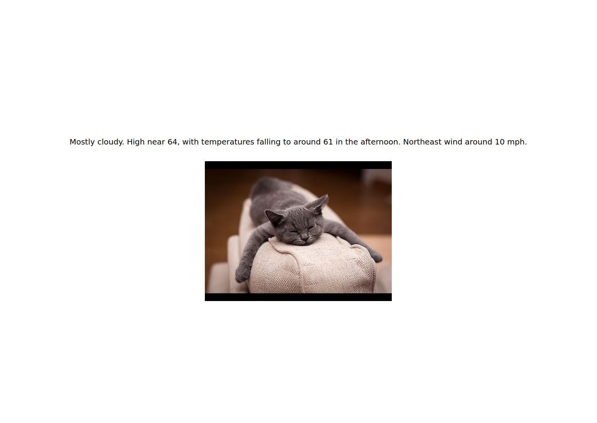

# Cats && Forecasts
## custom server with a custom REST API

This simple web app has very similar client-side (browser side) code from the [fetch](https://github.com/net-art-uchicago/web-app-demos/tree/fetch) example, as well as it's own custom server similar to the one I made in the [custom-server](https://github.com/net-art-uchicago/web-app-demos/tree/custom-server) example, except that rather than using the DOG CEO API to request a random dog image, I've created my own REST API which the index page sends a fetch request to in order to retrieve a random cat image.
